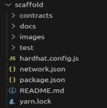

### .获取项目
请先下载我们准备的测试案例脚手架工程。项目结构如下图所示：



这是一个典型的hardhat项目。

其中有两个主要目录：

1. contracts目录存放的是所有的合约源代码。
2. test目录存放的是所有针对上述合约的测试案例。

3个配置文件：

1. packages.json 管理项目依赖库版本，如果依赖库（比如我们的concurentlib库）升级了。
2. hardhat.config.js 主要管理hardhat工程属性，一般不需要变更。
3. network.json 与节点相关的配置，如下面的示例：

```json
{
  "TestnetInfo": {
     "url": "http://192.168.117.128:8545", //对应节点的rpc-url
     "accounts": ["5bb1315c3ffa654c89f1f8b27f93cb4ef6b0474c4797cf2eb40d1bdd98dc26e7",
                  "2289ae919f03075448d567c9c4a22846ce3711731c895f1bea572cef25bb346f",
                  "19c439237a1e2c86f87b2d31438e5476738dd67297bf92d752b16bdb4ff37aa2",
                  "236c7b430c2ea13f19add3920b0bb2795f35a969f8be617faa9629bc5f6201f1",
                  "c4fbe435d6297959b0e326e560fdfb680a59807d75e1dec04d873fcd5b36597b",
                  "f91fcd0784d0b2e5f88ec3ba6fe57fa7ef4fbf2fe42a8fa0aaa22625d2147a7a",
                  "630549dc7564f9789eb4435098ca147424bcde3f1c14149a5ab18e826868f337",
                  "2a31c00f193d4071adf4e45abaf76d7222d4af87ab30a7a4f7bae51e28aceb0a",
                  "a2ffe69115c1f2f145297a4607e188775a1e56907ca882b7c6def550f218fa84",
                  "d9815a0fa4f31172530f17a6ae64bf5f00a3a651f3d6476146d2c62ae5527dc4",
                  "134aea740081ac7e0e892ff8e5d0a763ec400fcd34bae70bcfe6dae3aceeb7f0"
                  ],
     "addrs": ["0xaB01a3BfC5de6b5Fc481e18F274ADBdbA9B111f0",
              "0x21522c86A586e696961b68aa39632948D9F11170",
              "0xa75Cd05BF16BbeA1759DE2A66c0472131BC5Bd8D",
              "0x2c7161284197e40E83B1b657e98B3bb8FF3C90ed",
              "0x57170608aE58b7d62dCdC3cbDb564C05dDBB7eee",
              "0x9F79316c20f3F83Fcf43deE8a1CeA185A47A5c45",
              "0x9f9E0F23aFd5404b34006678c900629183c9A25d",
              "0xd7cB260c7658589fe68789F2d678e1e85F7e4831",
              "0x230DCCC4660dcBeCb8A6AEA1C713eE7A04B35cAD",
              "0x8aa62d370585e28fd2333325d3dbaef6112279Ce",
              "0xc8bc50cA2443F4cE0ebF1bC9396B7f53f62e9C13"
              ],
     "chainId": 118
   }
}
```

可以看到我们默认提供了11个账户，用于测试时使用。

下载脚手架工程后，我们需要修改该配置文件（network.json），把TestnetInfo.url修改为您启动的节点rpc。

在scaffold路径下，执行如下指令，来安装依赖库

```shell
scaffold> yarn
```

### .启动测试

我们脚手架工程中默认集成了几个测试案例，您可以直接启动测试脚本运行，也可以以该案例为基础来构造自己的测试。测试案例启动指令如下：

```shell
scaffold> yarn hardhat run test/测试案例文件名 --network TestnetInfo
```

### .测试案例

目前默认集成的测试案例如下：

| Example                                  |                                                              |
| ---------------------------------------- | ------------------------------------------------------------ |
| **[Subcurrency](./docs/subcurrency.md)** | From Solidity's official document, a naturally parallelizable without needing modification. |
| [Parallel Like](./docs/parallel-like.md) | Utilizes Arcology's concurrent library to handle parallel `like` calls to the same contract |


