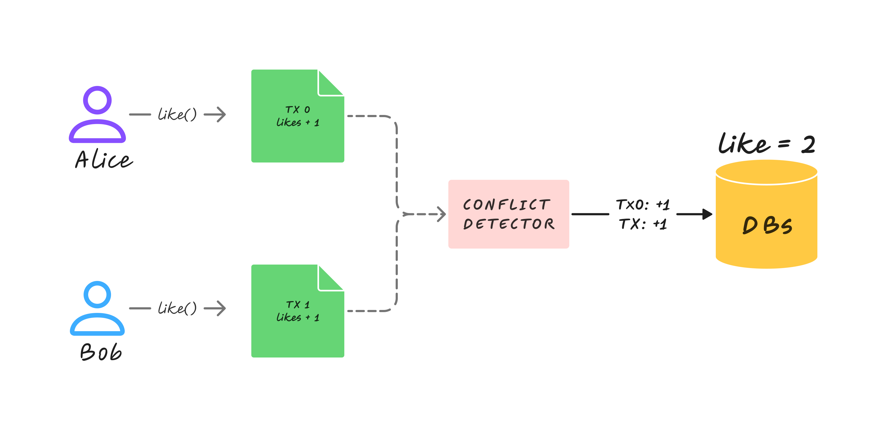

# Parallel Like

This example demonstrates how to implement a simple like counter that can handle concurrent updates using Arcology's U256Cumulative data structure.

## Sequential Version

The contracts define a simple counter that tracks how many times the like() function is called. Each call increments the likes count by 1. In the sequential implementation, the `likes` variable is a contention point, since multiple transactions trying to update the same variable simultaneously to trigger the conflict determinism mechanism of to prevent inconsistent state.

``` solidity
// SPDX-License-Identifier: GPL-3.0
pragma solidity >=0.8.0 <0.9.0;

contract Like {
    uint public likes;

    function like() public {
        likes += 1;
    }
    
   function get() public view returns(uint256){
        return likes;
    }        
}
```


## Parallelized Version

The parallel version replaces the `likes` counter with Arcology’s U256Cumulative, with a lower bound of 0 and higher bound of uint256's maximum value. It is a thread-safe, deterministic data structure. When like() is called in parallel, it adds the delta value to its internal buffer, rather than directly updating the state. The deltas are lazily applied only after each parallel batch or on read.

``` solidity
// SPDX-License-Identifier: GPL-3.0
pragma solidity >=0.8.0 <0.9.0;

contract Like {
    uint public likes;

    function like() public {
        likes += 1;
    }
    
   function get() public view returns(uint256){
        return likes;
    }        
}
```

## What Happens Behind the Scenes:
In the diagram below, three users, Alice and Bob, each submit a transaction (TX 0 and TX 1) that calls the function like(). Alice (TX 0) and Bob (TX 1) both call like(), which increments a shared cumulative integer.  These operations are commutative and associative, so they can be safely executed in parallel.

<p align="center">
   
</p>

>>  Please check out [this document for more details](https://doc.arcology.network/arcology-concurrent-programming-guide/data-structure/cumulative-integer) about the U256Cumulative data structure.


### Running the Demo

Run the example:
```shell 
   scaffold> yarn hardhat run test/test-like.js --network TestnetInfo
```
